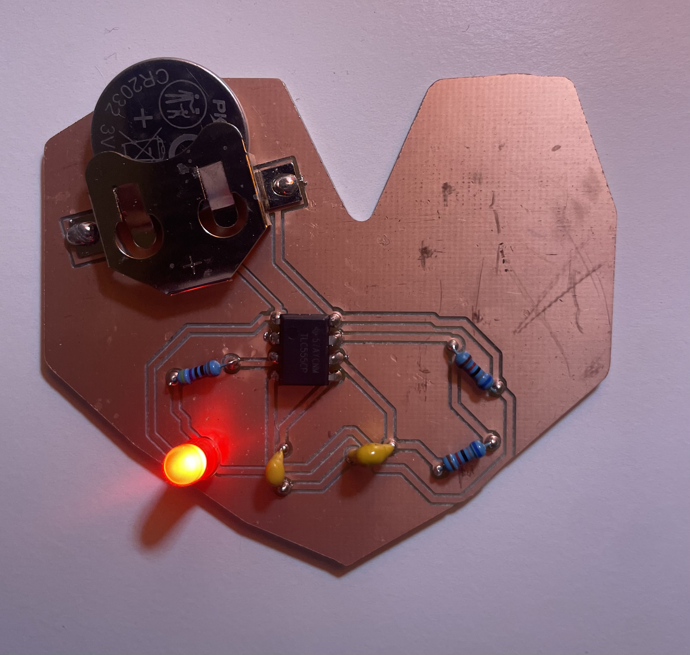

# Wired for Love :heart:

For this project, I designed and created a heart-shaped PCB powered by a 555 timer to create a blinking LED pendant. The goal was to gain hands-on experience with PCB layout, CNC milling, and soldering while creating a heart inspired by Valentine’s Day.

## Hero Shot

## Video
## Demo Video
)

## Reflection 
In the beginning, I was confused about which components needed to be connected. The schematic felt overwhelming, and I struggled to understand how something so technical could turn into a meaningful shape. But as I became more comfortable with the layout, I found that it was actually quite fun to rearrange the components and manipulate the traces to create different shapes. The circuit itself has strict rules, but within those rules, there is still space for creativity. 

I chose to create a heart in honor of Valentine’s Day, but not just because of the holidays itself, but because of the meaning it holds. I think the reason why people love (and hate) Valentine’s Day is because it’s one of the only times in the year where it is acceptable (even encouraged) to be so vulnerable. To show love is to make yourself the most vulnerable. The heart symbolizes vulnerability, growth, and openness. Something so delicate can still be created by rough materials and heated metals. Soldering beads can become petals. Copper traces can become a heartbeat.

The heart reflects my belief that engineering doesn’t have to feel cold or detached. As a CS major, I hope to build strong foundational skills so that I can create creatively not rigidly. Through this portfolio, I am learning to see beauty in materials that aren’t traditionally seen as soft or delicate, and to find ways to make engineering feel personal.
