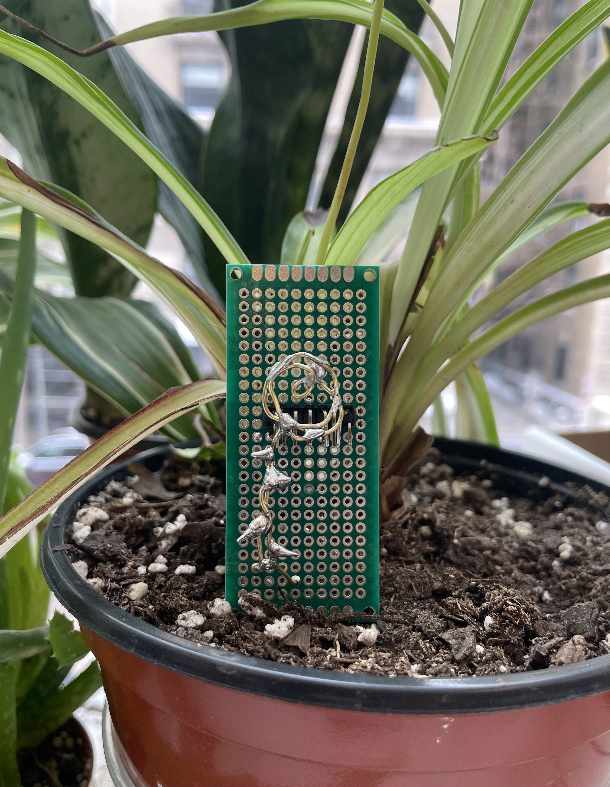
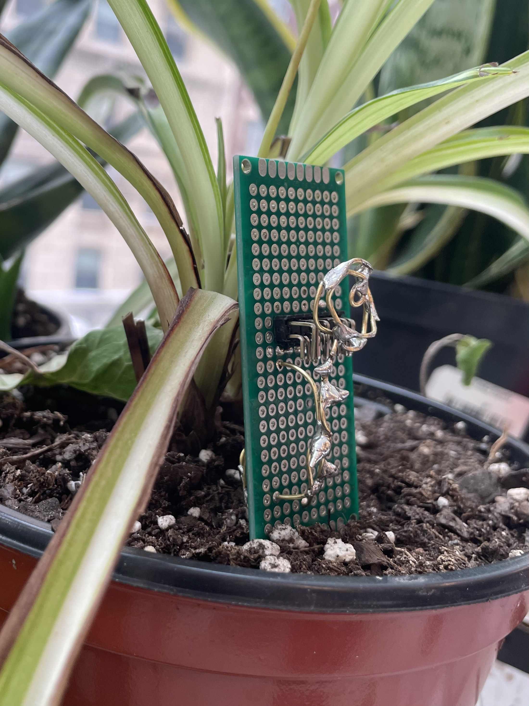
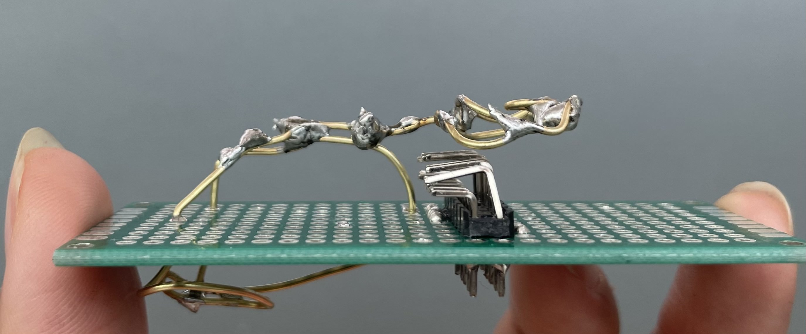
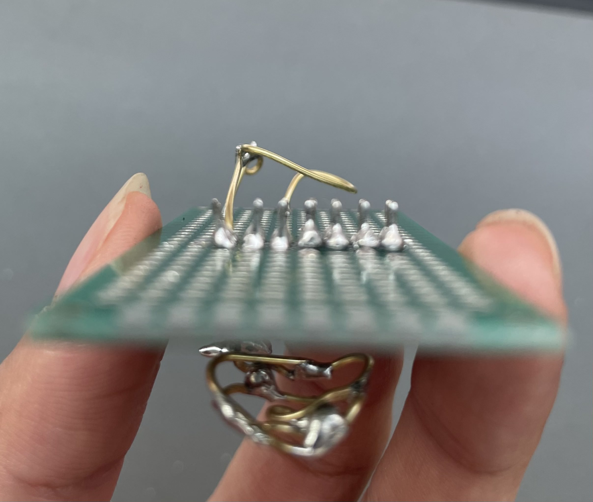
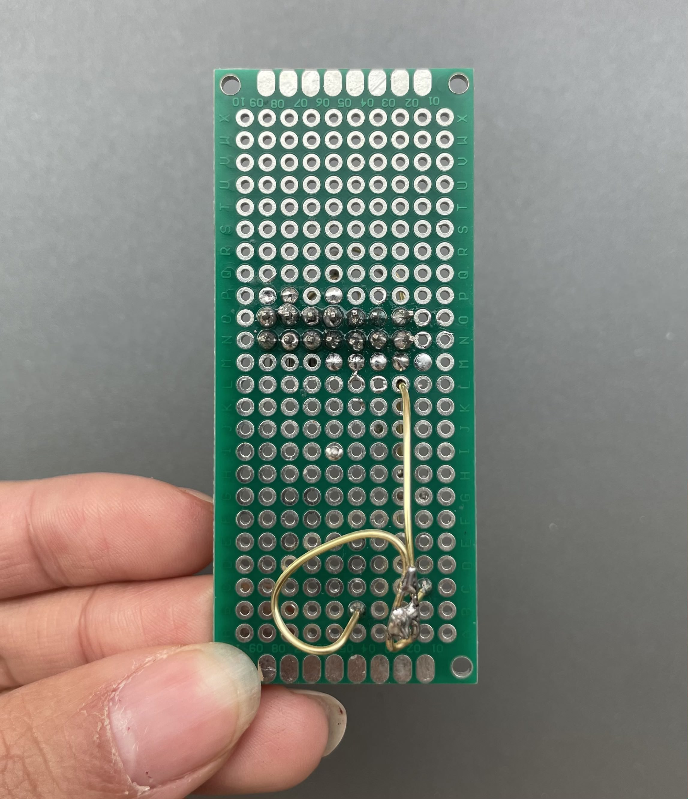

# Blooming Under Heat

For this project, I used a protoboard, 12-pin header, brass rod, and soldering iron to create a flower sculpture. I explored how to solder pins onto a board, shape solder beads, and bend brass rods to create forms of art.

## Hero Shot

## Alternate Angle

## Detail Shots

## Reflection 
Starting this project was very intimidating because I had no experience with soldering, protoboards, or brass rods before, and my first attempt at soldering the header pins was a mess. In determination for more practice and pushed by a bit of perfectionism, I restarted on a new board and learned that less solder, keeping the iron hand still and feeding in the solder, and taking breaks between beads all made a big difference. While soldering, I noticed how the solder could build outward in layers, which reminded me of leaves growing off stems and inspired me to twist and curve the brass rod into rose shaped petals, and solder outward to build the leaves along the stem.

To me, this piece is a reminder to always look at things in a different way. Delicate flowers and industrial materials usually don’t belong in the same sentence, but combining them together resulted in a special and meaningful flower to me. Living in a somewhat pessimistic society has trained our minds to only see the flaws and cracks in things, but I believe everything is beautiful and meaningful. We just need to look at things in a different way. 

